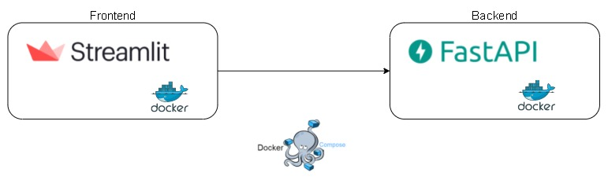

# Expected-Returns



---
Simple and neat project to give expected returns for global equity markets.

- **Streamlit frontend**, for user to interact with the backend API and visualize the results
- **FastApi backend** to handle retrieving data.
- **SQLModel database** along with FastAPI to communicate with backend
- All parts are **containerized with Docker**, to mock micro-services
- Final application uses **Docker Compose to orchestrate communication** between the three micro-services

---

## Running the application

```sh
cd expected_returns
docker-compose build
docker-compose up
```
- FastAPI backend documentation available at http://localhost:8000/docs
- FastAPI database documentation available at http://localhost:8080/docs
- Streamlit frontend available at http://localhost:8501