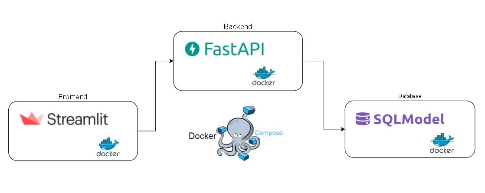

# Expected-Returns



---
Simple and neat project to give expected returns for global equity markets.

- FastApi for the backend to handle retrieving data.
- Streamlit for the frontend, for user to interact with the backend API and visualize the results
- Both parts are containerized with Docker, to mock micro-services
- Final application is orchestrated with Docker Compose so the two micro-services can talk to each other

---

## Running the application

```sh
cd expected_returns
docker-compose build
docker-compose up
```
- FastAPI endpoint documentation available at http://localhost:8000/docs
- Streamlit frontend available at http://localhost:8501.